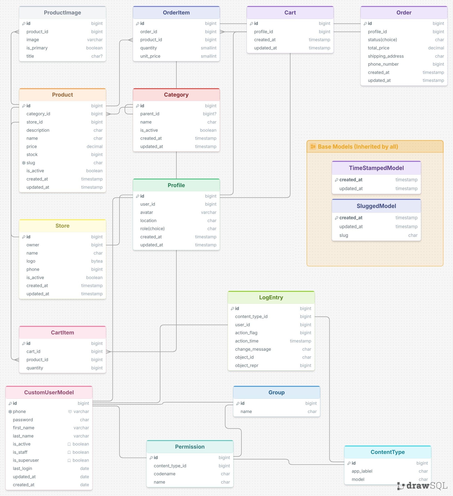

## Digichera
---

## Database Schema

The project utilizes a relational database structure designed for scalability and efficiency. The following diagram illustrates the entity-relationship model, including core components such as Users, Products, Orders, and Stores.

### Interactive Schema
You can view and explore the full, interactive database diagram on DrawSQL here:
[View Interactive Diagram](https://drawsql.app/teams/ehsan-barghamadi/diagrams/digichera)

### Architecture Overview

---
---

## Tech Stack
* **Language:** Python 3.x
* **Framework:** Django
* **Database:** PostgreSQL (Recommended)
* **Design Tool:** [DrawSQL](https://drawsql.app/)

