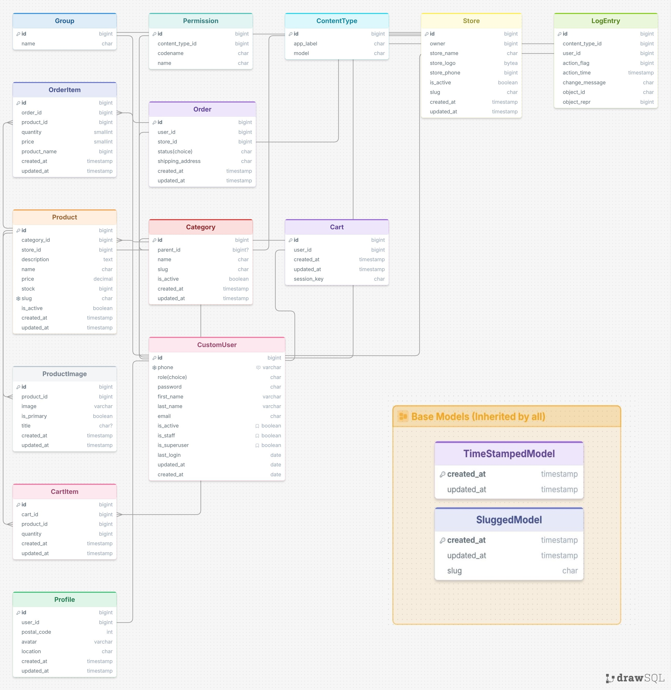

<div align="center">

# Digichera

**A multi-vendor e-commerce marketplace built with Django**

Sellers open their own stores, list products, and manage orders — customers browse every store from one catalog and check out in a single flow, with orders automatically split per vendor behind the scenes.

[](https://www.python.org/)
[](https://www.djangoproject.com/)
[](https://www.sqlite.org/)
[](https://www.postgresql.org/)

</div>

---

## Overview

Digichera is a Django-based multi-vendor marketplace, in the spirit of platforms like Digikala or Basalam. Any visitor can register with just a phone number and pick a role — **customer** or **seller** — at signup; sellers can then open a single storefront and start listing products. Customers can add products from several different stores to one cart; at checkout, that cart is split into one order per store automatically, and stock is checked against every item before any order is created.

The project is organized as a set of small, decoupled Django apps rather than one monolith, each owning a single concern (users, stores, products, cart, orders, profiles).

## Features

- **Phone-based authentication** — custom user model, no username or email required to sign up or log in
- **Role-aware accounts** — `customer`, `seller`, and `staff` roles on the same user model, chosen at registration
- **Seller storefronts** — each seller owns one `Store`, with an auto-generated slug and a compressed, auto-resized logo (via Pillow)
- **Nested product categories** — a self-referential category tree with cycle protection (`clean()` blocks a category from becoming its own ancestor) and cascading soft-delete
- **Product catalog** — multiple images per product, with a designated primary image and automatic thumbnailing/compression via Pillow on save
- **Guest & authenticated carts** — anonymous users get a session-based cart that transparently merges into their account cart on login/register
- **Multi-vendor checkout** — one cart, split into a separate `Order` per store, each with its own `OrderItem`s and a shipping-address snapshot taken from the customer's profile
- **Stock-safe checkout** — the whole checkout view runs inside `transaction.atomic()`, re-checks every item's stock right before creating orders, and locks the affected product rows with `select_for_update()` when running on PostgreSQL
- **Order lifecycle** — `pending → paid → shipped → delivered`, with sellers restricted to valid status transitions on their own store's orders
- **Search & category filtering** on the product catalog
- **Access-controlled seller actions** — decorators (`store_required`, `store_owner_required`) guard store/product management views
- **Django admin** wired up for all models

## Tech Stack

| Layer         | Technology                                                     |
| ------------- | -------------------------------------------------------------- |
| Backend       | Django 6.0                                                     |
| Database      | SQLite (development) · PostgreSQL (production, via `psycopg2`) |
| Images        | Pillow (server-side resize/compression on upload)              |
| Localization  | django-localflavor (Iranian postal code validation), `fa-ir`   |
| Configuration | python-decouple (environment-based settings)                   |
| Frontend      | Django Templates + Bootstrap                                   |

## Project Structure

```
Digichera/
├── config/          # Project settings (base / dev / prod), root URLconf, WSGI/ASGI
├── core/            # Shared abstract models (TimeStampedModel, SluggedModel) & decorators
├── user/            # Custom phone-based user model, auth views
├── account/         # Customer profile (address, postal code, avatar)
├── store/           # Seller storefronts
├── product/         # Categories, products, product images
├── cart/            # Guest & user shopping cart
├── order/           # Checkout, orders, order items, status transitions
├── page/            # Static-ish pages (home, about, contact, bank)
├── static/          # Frontend assets (CSS/JS)
├── templates/       # Shared templates
└── docs/            # Database diagram
```

## Database Schema



## Getting Started

### Prerequisites

- Python 3.x
- pip / venv

### Installation

```bash
# Clone the repository
git clone https://github.com/<your-username>/digichera.git
cd digichera

# Create and activate a virtual environment
python -m venv venv
source venv/bin/activate   # Windows: venv\Scripts\activate

# Install dependencies
pip install -r requirements.txt

# Configure environment variables
cp .env.example .env
```

### Environment Variables

Edit `.env` with your own values:

```env
SECRET_KEY=your-secret-key
DEBUG=True
ALLOWED_HOSTS=127.0.0.1,localhost

# Only required when DJANGO_ENV=prod (PostgreSQL)
DB_NAME=digichera
DB_USERNAME=postgres
DB_PASSWORD=postgres
DB_HOST=localhost
DB_PORT=5432
```

By default the project runs with SQLite and no extra configuration needed. Set `DJANGO_ENV=prod` in your environment to switch `config/settings/__init__.py` over to `config.settings.prod`, which uses PostgreSQL with the variables above.

### Run

```bash
python manage.py migrate
python manage.py createsuperuser
python manage.py runserver
```

Visit `http://127.0.0.1:8000/` for the storefront and `http://127.0.0.1:8000/admin/` for the admin panel.

## Roadmap / Ideas

- Payment gateway integration for the checkout → `page:bank` flow
- Seller-side product/order dashboards beyond the Django admin
- REST API layer for a decoupled frontend
- Automated test suite (unit & integration tests for models, views, and the checkout flow)
- Caching for frequently-read data (product listing, categories)
- Pagination on product listing/search and store/order views
- Throttling/rate-limiting on auth and checkout endpoints

## License

No license has been chosen for this project yet. Add a `LICENSE` file to specify how others may use this code.

---

<div align="center">
  <br>
  
  <br>
  <b>😎 New features and improvements are on the way! 😄</b>
</div>

Developed by [Ehsan Barghamadi](https://github.com/EhsanBarghamadi)
